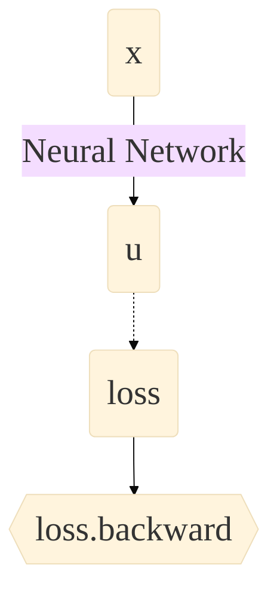

```mermaid
%%{init: {'theme': 'base', 'themeVariables': { 'fontSize': '30px', 'fontFamily': 'times'}}}%%
graph TD
    A(x) -- Neural Network --> B(u)
    B .-> E(loss)
    E --> F{{loss.backward}}
```
